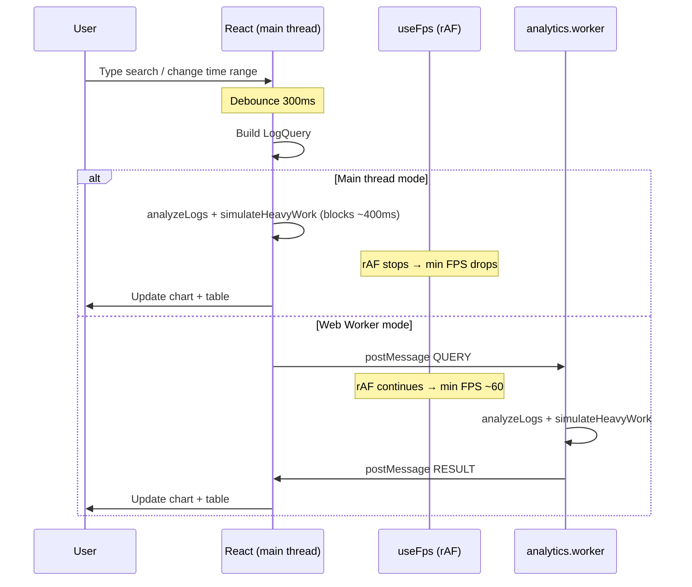

# Log Analyzer — Educational Video Guide

A reference doc for explaining the **Web Worker pattern** demo: what we built, what problem it simulates, how to read the metrics, and how to compare main-thread vs worker execution.

---

## 1. Elevator pitch (30 seconds)

> We built a mini Splunk-style log dashboard. The server sends **50,000 log lines once**. All search, filtering, aggregation, and pagination happen **entirely in the browser**. The twist: you can run that analysis on the **main thread** (UI freezes) or in a **Web Worker** (UI stays smooth). Same code, same data — different thread.

**Core lesson:** Debouncing makes *typing* smooth, but it does **not** make *analysis* non-blocking. Only moving work off the main thread does.

---

## 2. High-level tech spec

### Stack

| Layer | Tech | Role |
|-------|------|------|
| **Server** | Node.js + Express | Serves raw logs via `GET /api/logs` (port 8790) |
| **UI** | React 19 + Vite + Tailwind | Splunk-style investigation dashboard |
| **Worker** | `analytics.worker.ts` (Vite module worker) | Runs the same analysis off the main thread |
| **Shared logic** | `lib/analysis.ts` | `analyzeLogs()` used by both main thread and worker |

### Data flow

```
┌─────────────────────────────────────────────────────────────────┐
│  Server (one-time fetch)                                        │
│  GET /api/logs  →  50,000 LogEntry objects (JSON)               │
└────────────────────────────┬────────────────────────────────────┘
                             │
                             ▼
┌─────────────────────────────────────────────────────────────────┐
│  React UI (main thread)                                         │
│  • SearchBar: keyword, level filter, time range presets         │
│  • Debounce keyword input (300ms) before triggering analysis    │
│  • Timeline chart, level summary, paginated table (50 rows/page)│
│  • FPS meter + processing mode toggle                           │
└──────────────┬──────────────────────────────┬───────────────────┘
               │ mode = "main"                 │ mode = "worker"
               ▼                               ▼
   runMainThreadDemoAnalysis()          postMessage → Worker
   (blocks UI ~400ms+)                  (UI stays at 60fps)
               │                               │
               └───────────┬───────────────────┘
                           ▼
              AnalysisResult (aggregations + 50 rows + timeline)
```

### What analysis does (`analyzeLogs`)

For every query, the client scans all ingested logs and:

1. **Filters** by time window, log level, and keyword (case-insensitive substring on `message`)
2. **Aggregates** counts per level (ERROR / WARN / INFO / DEBUG)
3. **Builds a timeline** — histogram buckets over the selected range
4. **Paginates** — returns only `PAGE_SIZE` (50) rows for the table; full match count is metadata

**Important design choice:** Compute globally over the full dataset, transfer minimally. Only 50 rows + summary stats cross the worker boundary — not all 25k+ matching rows.

### Key constants

| Constant | Value | Purpose |
|----------|-------|---------|
| `DEBOUNCE_MS` | 300 | Delay before re-running analysis after keyword search changes |
| `PAGE_SIZE` | 50 | Rows shown in the events table per page |
| `DEMO_HEAVY_WORK_MIN_MS` | 400 | Artificial CPU burn so jank is obvious on main thread |
| Dataset size | 50,000 logs | Generated server-side if missing |

### Hook architecture (UI)

The analytics logic is split into focused hooks:

| Hook | Responsibility |
|------|----------------|
| `useLogDataset` | Fetch `/api/logs` on mount |
| `useLogFilters` | Keyword, level, time range, page + debouncing → builds `LogQuery` |
| `useAnalyticsWorker` | Worker lifecycle, ingest, query, stale-result guard |
| `useLogAnalytics` | Composes the above; one effect runs analysis (main or worker) |
| `useFps` | Rolling FPS meter via `requestAnimationFrame` |

---

## 3. The problem we're simulating

### Real-world scenario

Imagine a Datadog/Splunk-style dashboard where an on-call engineer:

- Loads a large chunk of logs for an incident
- Types search terms, changes time ranges, flips level filters
- Expects the UI to **stay responsive** while crunching numbers

### What goes wrong on the main thread

JavaScript in the browser is **single-threaded** for your app code. The main thread also handles:

- React rendering
- CSS animations (our spinner)
- `requestAnimationFrame` callbacks
- User input

If you run a synchronous loop over 50,000 logs **plus** extra CPU work on the main thread, everything else pauses. The user sees:

- Spinner **freezes**
- Clicks feel **laggy**
- Charts update only after the block ends

### What we deliberately exaggerate

`simulateHeavyWork()` runs a tight CPU loop for **at least 400ms** after every analysis pass. This is **not** realistic production overhead — it's a teaching aid so the freeze is impossible to miss on camera.

```ts
// lib/analysis.ts — called after analyzeLogs in BOTH modes
export function simulateHeavyWork(minMs = 400): void {
  // busy-loop until minMs elapsed
}
```

On the **main thread**, this blocks the UI.  
In the **worker**, the same function runs but the main thread is free to keep animating.

### What debouncing does (and does not do)

Both modes debounce filter changes by **300ms**:

- **Does:** Prevent re-running analysis on every keystroke — typing feels smooth
- **Does not:** Make analysis non-blocking — when the debounced query fires, main-thread mode still freezes for ~400–500ms

**Talking point:** "Debounce reduces *how often* you block the UI. A Web Worker eliminates blocking the UI during compute."

### Embedded incident story (bonus context)

The generated dataset contains a latent rollout failure in `payment-service` / `prod` around Wed 2:30pm PT — repeated `PriceCalculator.applyDiscount` errors that grow over ~30 minutes, then stop. This gives the dashboard a realistic "investigation" feel, but the **performance lesson** is independent of the story.

**Good demo search:** `applyDiscount` or `PriceCalculator` with **Last 4 hours**.

---

## 4. Metrics: what good and bad mean

The dashboard shows three live signals during the demo.

### FPS (min / avg)

Measured by `useFps` using `requestAnimationFrame`, sampled every **~500ms**.

#### How avg is calculated

```
avg = round((frameCount × 1000) / elapsedMs)
```

- Count how many animation frames fired in the window
- Divide by wall-clock time
- At 60fps, you'd expect ~30 frames in 500ms → avg ≈ 60

**When the main thread blocks:** `requestAnimationFrame` stops firing. Few frames in 500ms of real time → **avg drops** (e.g. 10–15).

#### How min is calculated

```
min = round(1000 / maxFrameMs)
```

- Track the **longest gap** between consecutive `rAF` callbacks in the window
- Convert that worst frame duration to an equivalent FPS

**Example:** One 400ms stall → `min = 1000/400 ≈ 2–3`.

| Reading | Healthy (main idle / worker active) | Bad (main thread during analysis) |
|---------|-------------------------------------|-----------------------------------|
| **min** | ≥ 55 (green) | < 30 (red) — a long frame stall occurred |
| **avg** | ~58–60 | ~10–20 — few frames delivered in the window |

**Color thresholds** (`FpsIndicator`):

- Green: `min ≥ 55`
- Amber: `30 ≤ min < 55`
- Red: `min < 30`

#### Visual cue: the spinner

A CSS-animated ring next to the FPS numbers. If it **stops rotating** during analysis, the main thread was blocked. In worker mode it should **keep spinning**.

### Last run (duration)

Wall-clock time for the last analysis pass, in milliseconds.

- **Main thread:** Includes `analyzeLogs` + `simulateHeavyWork` — typically **450–500ms+**
- **Worker:** Similar duration for the *work itself*, but measured inside the worker — the UI is not blocked for that time

Label switches to **"Processing…"** while `isProcessing` is true.

### What "good" looks like in each mode

| Signal | Main thread (expected) | Web Worker (expected) |
|--------|------------------------|------------------------|
| Spinner during search | Freezes | Keeps animating |
| FPS min during search | Drops to single digits | Stays ~55–60 |
| FPS avg during search | Drops to ~10–15 | Stays ~58–60 |
| Last run | ~450–500ms | ~450–500ms (work time is similar) |
| Typing in search box | Smooth (debounced) | Smooth (debounced) |

**Key insight for the video:** Last run can be **similar in both modes** — the worker doesn't necessarily make the *computation* faster, it makes the *UI* responsive while computation happens elsewhere.

---

## 5. Web Worker integration

### Files involved

```
ui/src/
├── workers/analytics.worker.ts   # Worker entry point
├── hooks/useAnalyticsWorker.ts # React lifecycle wrapper
├── hooks/useLogAnalytics.ts    # Mode switch + orchestration
└── lib/analysis.ts             # Shared analyzeLogs() logic
```

### Worker protocol (message types)

**Main → Worker (inbound)**

| Type | Payload | When |
|------|---------|------|
| `INGEST` | `{ logs: LogEntry[] }` | After fetch, or when logs change |
| `QUERY` | `{ requestId, query: LogQuery }` | Debounced filter/page change |

**Worker → Main (outbound)**

| Type | Payload | When |
|------|---------|------|
| `INGESTED` | `{ total: number }` | Logs copied into worker memory; UI sets `workerReady = true` |
| `RESULT` | `{ result: AnalysisResult }` | Query complete |
| `ERROR` | `{ message: string }` | Uncaught exception in worker |

### Lifecycle

```
1. User toggles to "Web Worker"
   → useAnalyticsWorker creates Worker via Vite module URL
   → workerRef stored, previous worker terminated on cleanup

2. Logs arrive from server
   → postMessage({ type: "INGEST", logs })
   → Worker stores logs in module-level `sourceLogs`
   → Worker replies INGESTED → main thread sets ready = true

3. User changes search / time range (debounced)
   → requestId incremented
   → postMessage({ type: "QUERY", requestId, query })
   → Worker runs analyzeLogs + simulateHeavyWork
   → Worker replies RESULT

4. Main thread receives RESULT
   → Checks requestId matches latest (stale guard)
   → Updates chart, table, aggregations
```

### Stale result cancellation

When the user types quickly (even with debounce), multiple queries can be in flight. Each query gets a monotonically increasing `requestId`. The worker echoes it back in `AnalysisResult`. On the main thread:

```ts
if (data.result.requestId !== latestRequestIdRef.current) return;
```

Outdated responses are silently dropped — the UI always reflects the latest query.

### Creating the worker (Vite)

```ts
const worker = new Worker(
  new URL("../workers/analytics.worker.ts", import.meta.url),
  { type: "module" }
);
```

Vite bundles the worker as a separate module. Both the worker and main thread import the same `analyzeLogs` function — **one implementation, two execution contexts**.

### Mode switch in `useLogAnalytics`

```ts
const useWorker = mode === "worker";

useEffect(() => {
  if (logs.length === 0) return;
  if (useWorker && !workerReady) return;

  const requestId = ++requestIdRef.current;
  setIsProcessing(true);

  if (useWorker) {
    workerQuery(requestId, query);  // async, non-blocking
    return;
  }

  const analysis = runMainThreadDemoAnalysis(logs, query, requestId);  // sync, blocks
  setResult(analysis);
  setIsProcessing(false);
}, [useWorker, workerReady, logs, query, workerQuery]);
```

Same `query` object, same `analyzeLogs` logic — only the **execution thread** changes.

---

## 6. How to run the comparison (demo script)

### Setup

```bash
# From repo root
npm run setup:log-analyzer   # first time
npm run dev:log-analyzer
```

Open http://localhost:5173 (Vite proxies `/api` → server on 8790).

### Step-by-step for recording

**Act 1 — Main thread pain**

1. Confirm mode is **Main thread**
2. Wait for "Ingested 50,000 logs" to appear
3. Type `applyDiscount` in the keyword search (or click a time-range pill)
4. Point at:
   - Spinner **freezing**
   - FPS **min** dropping to single digits
   - FPS **avg** dropping to ~10–15
   - "Processing…" then **Last run ~486ms**

**Act 2 — Web Worker fix**

1. Toggle to **Web Worker** (worker re-ingests logs — brief moment until ready)
2. Repeat the **exact same** search / time-range change
3. Point at:
   - Spinner **still animating**
   - FPS **min** staying ~55–60
   - Same **Last run** duration (work still takes ~486ms, just not on main thread)

**Act 3 — Debounce nuance (optional)**

1. In either mode, type quickly in the search box
2. Show that **typing** is smooth (debounce delays analysis)
3. Show that after you pause, analysis still blocks in main-thread mode

### Suggested talking points

1. "The server is dumb — it only stores raw events. All investigation logic is client-side."
2. "We fetch once, then filter 50k rows on every query. That's the expensive part."
3. "Debounce helps UX while typing, but when the query fires, main-thread JS still blocks everything."
4. "The worker runs identical code. We only send back 50 rows + aggregates — not the full result set."
5. "requestId prevents race conditions when queries overlap."
6. "Workers don't make CPU work faster — they keep the UI thread free."

---

## 7. Architecture diagram (for slides)



---

## 8. File map (quick reference)

| File | What to show on screen |
|------|------------------------|
| `lib/analysis.ts` | `analyzeLogs`, `simulateHeavyWork`, `runMainThreadDemoAnalysis`, `runWorkerDemoAnalysis` |
| `workers/analytics.worker.ts` | `INGEST` / `QUERY` handler |
| `hooks/useAnalyticsWorker.ts` | Worker create/destroy, postMessage, stale guard |
| `hooks/useLogAnalytics.ts` | Single effect that branches on mode |
| `hooks/useFps.ts` | `requestAnimationFrame` FPS calculation |
| `components/FpsIndicator.tsx` | Spinner + color thresholds |
| `App.tsx` | Mode toggle, demo tip text |
| `server/src/index.ts` | `GET /api/logs` — one fetch, 50k lines |

---

## 9. Common viewer questions

**Q: Why does Last run show ~486ms in both modes?**  
A: The work takes the same time. The worker moves it off the UI thread; it doesn't magically speed up CPU.

**Q: Why is avg low but min was high before we fixed the bug?**  
A: Early versions tracked the *fastest* frame for "min" instead of the *slowest*. Fixed: min now uses `maxFrameMs` (longest gap between frames).

**Q: Could we use `useMemo` instead of a worker?**  
A: `useMemo` still runs on the main thread during render. It doesn't prevent blocking — it only caches results between renders.

**Q: When should you use a Web Worker in production?**  
A: CPU-heavy work that doesn't need DOM access: parsing large files, indexing, compression, image processing, analytics over big in-memory datasets.

**Q: What's the cost of workers?**  
A: `postMessage` serializes data (structured clone). We mitigate by ingesting logs once and only returning 50 rows + summaries per query.
