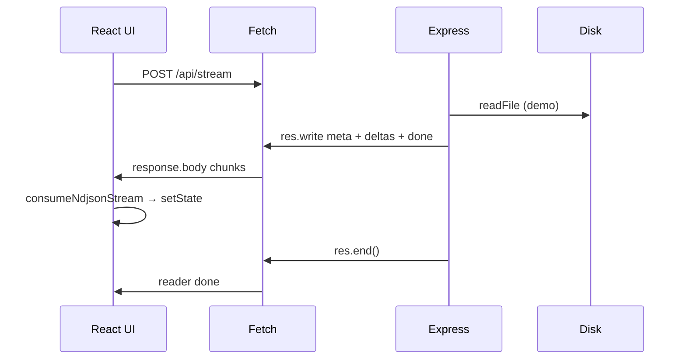

# Streaming UI guide

This document summarizes how **streaming-ui** works end to end: server first, then client. It is written for readers who are learning ChatGPT-style UIs and will ask the same questions we did while building the demo.

**Code map**

| Area | Main files |
|------|------------|
| Server | `server/src/index.ts`, `server/src/config.ts` |
| Client | `ui/src/stream/ndjson.ts`, `ui/src/hooks/useNdjsonFileStream.ts`, `ui/src/stream/events.ts` |

---

## Part 1 — Server (Express + NDJSON)

### What is NDJSON?

**NDJSON** (Newline Delimited JSON) means: one JSON value per line, lines separated by `\n`.

```json
{"type":"meta","source":"sample.md","chunkSize":16,"totalChars":42}
{"type":"assistant_delta","text":"Hello"}
{"type":"done"}
```

The server sends it with:

```ts
res.write(`${JSON.stringify(event)}\n`);
```

That format is easy to stream: the client can parse each line as soon as it arrives, without waiting for one giant JSON array or object.

---

### What does `POST /api/stream` do?

1. Set response headers for a live stream.
2. Read markdown from disk (demo only — see below).
3. Write a `meta` line, many `assistant_delta` lines, then `done`.
4. Call `res.end()` so the HTTP response finishes.

Event shapes (server `StreamEvent` in `index.ts`):

| `type` | Purpose |
|--------|---------|
| `meta` | Stream metadata (`source`, `chunkSize`, `totalChars`) |
| `assistant_delta` | Next slice of text |
| `done` | Normal end |
| `error` | Something went wrong |

---

### Why these headers?

```ts
res.setHeader("Content-Type", "application/x-ndjson; charset=utf-8");
res.setHeader("Cache-Control", "no-cache");
res.setHeader("Connection", "keep-alive");
res.setHeader("X-Accel-Buffering", "no");
```

**Q: What does `Connection: keep-alive` mean? When does the connection close?**

- On HTTP/1.1, the connection can stay open across multiple requests on the same TCP socket (`keep-alive`).
- For **this** request, the stream ends when the server calls `res.end()` (after `done` or `error`). That finishes the response body.
- `keep-alive` does **not** mean “keep streaming forever after `done`.” It means the socket may be reused for the next request (e.g. another `POST /api/stream`).
- The client can also close early with `AbortController` (Stop button).

**Q: Do these headers make `response.body` a `ReadableStream` on the client?**

No. The browser **always** exposes an HTTP body (when present) as `ReadableStream<Uint8Array>`. Headers describe the bytes and help proxies behave correctly; they do not define Fetch’s `body` type.

| Header | Role |
|--------|------|
| `Content-Type: application/x-ndjson` | Tells clients this is NDJSON |
| `Cache-Control: no-cache` | Avoid treating the response as a cacheable static file |
| `Connection: keep-alive` | HTTP/1.1 persistent connection hint |
| `X-Accel-Buffering: no` | Ask nginx not to buffer the whole body before forwarding |

Incremental UI updates come from the server calling `res.write()` **before** `res.end()`, not from the MIME type alone.

---

### Configuration (`server/src/config.ts`)

Env-driven settings:

| Variable | Default | Meaning |
|----------|---------|---------|
| `STREAM_UI_PORT` | `8788` | Listen port |
| `STREAM_CHUNK_SIZE` | `16` | Characters per `assistant_delta` (demo) |
| `STREAM_CHUNK_DELAY_MS` | `120` | Pause between chunks (`0` = full speed) |
| `STREAM_CONTENT_FILE` | `content/sample.md` | Relative to `server/` or absolute path |

Exported `config` includes `contentPath` (for `fs.readFile`) and `contentSource` (basename for `meta.source`).

---

### Q: Why is `totalChars` in `meta`? What about LLMs where length is unknown?

In this demo the server does `fs.readFile` **before** streaming, so it knows `markdown.length` upfront and sends it in `meta`.

Real LLM streaming usually:

- Omits total length in the first event, or
- Sends `usage` / token counts only in the **last** event,
- Ends on `done` or `finish_reason`, not when `text.length === totalChars`.

Treat `totalChars` here as a **teaching convenience**, not a production requirement.

---

### Q: For a huge file, do we `readFile` the whole thing on every request?

**Normally, no.** This demo reads the entire file into memory once per request, then **simulates** streaming by slicing the string and delaying between `res.write` calls.

Production patterns:

| Scenario | Typical approach |
|----------|------------------|
| Large file on disk | `fs.createReadStream()` — read a buffer, `res.write`, repeat; memory ~O(chunk size) |
| LLM API | No file; forward each token/delta as the provider sends it |
| `totalChars` | Optional; often unknown until the end |

Conceptually:

```
Demo:     readFile (whole file) → slice + delay → res.write (fake stream)
Better:   readStream / LLM       → res.write as data arrives (real stream)
```

---

## Part 2 — Client (Fetch + `consumeNdjsonStream`)

### Pipeline overview

```
POST /api/stream
  → fetch() returns Response
  → response.body: ReadableStream<Uint8Array>   // bytes, always (if body exists)
  → reader.read()                               // pull chunks
  → TextDecoder                                 // bytes → UTF-8 string
  → line buffer + split on "\n"                 // reassemble NDJSON lines
  → JSON.parse(line)                            // one StreamEvent
  → onEvent → React state (text, meta, done)
```

The hook `useNdjsonFileStream` calls:

```ts
await consumeNdjsonStream(response.body, applyEvent);
```

`consumeNdjsonStream` does not know about React; it only invokes `onEvent` per parsed line.

---

### Q: Why is `response.body` a `ReadableStream<Uint8Array>`?

That is how the **Fetch API** models any response body in modern browsers. It is not specific to Express or NDJSON.

- Use `response.json()` / `response.text()` if you want the **entire** body at once (the browser reads the stream to completion internally).
- Use `response.body` + a reader if you want to react **as chunks arrive**.

Whether you see many small chunks or one large chunk depends on how fast the server writes and the network — not on the TypeScript type of `body`.

---

### `consumeNdjsonStream` — reader, decoder, buffer

Core loop (`ui/src/stream/ndjson.ts`):

1. **`body.getReader()`** — exclusive reader for the byte stream.
2. **`while (await reader.read())`** — each `value` is a `Uint8Array` chunk; `done: true` when the response ends.
3. **`new TextDecoder().decode(chunk, { stream: true })`** — UTF-8 bytes → string. `stream: true` handles characters split across chunks (e.g. emoji).
4. **`buffer += decoded`** — append text; chunks are **not** aligned to line boundaries.
5. **Inner loop on `\n`** — peel complete lines, `JSON.parse`, call `onEvent`.
6. **Tail after stream ends** — parse last line if the server omitted a trailing newline.
7. **`reader.releaseLock()`** in `finally` — cleanup.

Malformed lines are ignored (demo tolerance); production code might fail fast or report parse errors.

---

### Concrete example: one line split across chunks

Server sends (conceptually):

```
{"type":"meta",...}\n
{"type":"assistant_delta","text":"Hello"}\n
{"type":"done"}\n
```

Network might deliver:

| Chunk | Decoded text (simplified) |
|-------|---------------------------|
| A | `{"type":"meta",...,"chunk` |
| B | `Size":16,...}\n{"type":"assistant_delta","text":"He` |
| C | `llo"}\n{"type":"done"}\n` |

After A: no `\n` yet → wait.  
After B: first line complete → `onEvent(meta)`; remainder held in `buffer`.  
After C: parse delta and done → UI updates incrementally.

Multiple lines in **one** chunk work too: the inner `for (;;)` drains every complete line in `buffer`.

---

### Hook behavior (`useNdjsonFileStream`)

| Event | UI effect |
|-------|-----------|
| `meta` | Sets subtitle info (`source`, `chunkSize`, `totalChars`) |
| `assistant_delta` | Appends `event.text` to displayed markdown |
| `done` | Stops “streaming” indicator |
| `error` | Shows error message |

**Stop** uses `AbortController` on `fetch`. That cancels the request; the body stream closes and the read loop exits.

---

## Part 3 — How server and client fit together



**Demo vs production**

| Piece | This repo | Typical production |
|-------|-----------|-------------------|
| Server read | Whole file, then slice | Stream from disk or LLM |
| Framing | NDJSON lines | NDJSON, SSE (`data: …\n\n`), or vendor format |
| Client parse | `consumeNdjsonStream` | Same idea; swap line parser for SSE |
| End signal | `{ type: "done" }` | `done` event / `finish_reason` |

`ui/src/stream/events.ts` notes that **SSE** (OpenAI, Anthropic, etc.) uses `data: {...}\n\n` instead of raw `{...}\n`; the React side would parse SSE frames then call the same `onTextDelta`-style handlers.

---

## Quick reference — questions we asked

1. **What is NDJSON?** — One JSON object per line, newline-separated.
2. **What does `Connection: keep-alive` do?** — Persistent HTTP connection; this response still ends at `res.end()`.
3. **Why `totalChars` in meta?** — Demo knows file size upfront; LLMs usually don’t.
4. **Do we read the whole file per request in production?** — Not for huge files; use read streams or token streams.
5. **Why is `response.body` a byte stream?** — Fetch API design; use a reader to process incrementally.
6. **What does `consumeNdjsonStream` do?** — Reader → decoder → line buffer → `JSON.parse` → `onEvent`.

---

## Run the demo

See [README.md](../README.md): start `server` on port 8788, `ui` with Vite proxy, click **Start streaming**.

Optional: slow down for recordings:

```bash
STREAM_CHUNK_DELAY_MS=200 npm run dev
```
